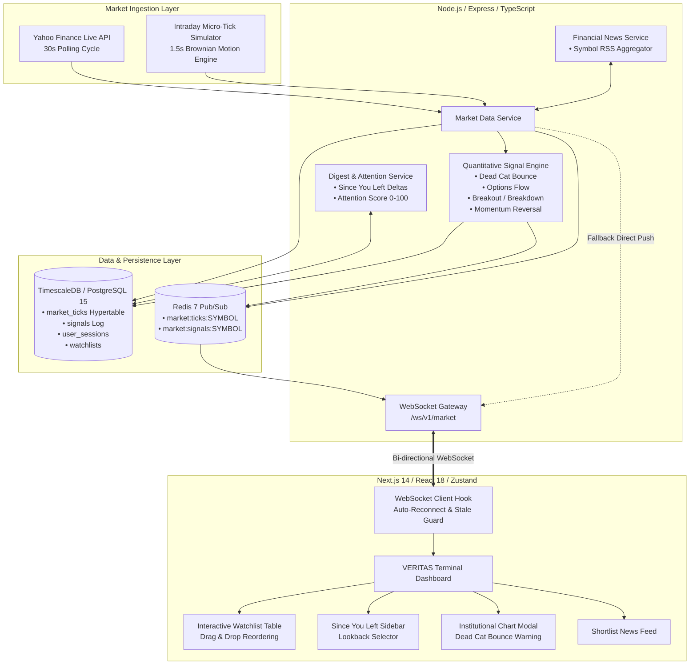

# ⚡ VERITAS - Institutional Market Intelligence & Smart Watchlist Platform

<div align="center">


**Sub-50ms streaming market telemetry, automated bull-trap detection, institutional flow analysis, and session delta intelligence for active equity & derivative traders.**

[Features](#-key-features) • [Architecture](#-system-architecture) • [Signal Engine](#-quantitative-signal-engine) • [API Specs](#-api--websocket-reference) • [Getting Started](#-getting-started) • [Deployment](#-deployment)

</div>

---

## 📌 Overview

Traditional stock watchlists are static, noisy spreadsheets. They flood active traders with endless price flickering without context, forcing them to mentally calculate price deltas, cross-reference multiple indicators, and constantly fall victim to retail bull-traps (such as **Dead Cat Bounces**).

**VERITAS** is an institutional-grade smart watchlist platform engineered to solve this information overload. It transforms raw market ticks into actionable market structure telemetry:

1. **Real-Time Streaming Engine**: Zero-polling WebSocket pipeline broadcasting live quotes and institutional order flow with sub-50ms latency.
2. **Quantitative Signal Engine**: Autonomous multi-pattern detection engine flagging **Dead Cat Bounces**, resistance breakouts, institutional options flow, momentum reversals, and volatility spikes.
3. **"Since You Left" Session Intelligence**: Intelligent session delta digest that automatically analyzes what occurred in your watchlist while you were away, ranking stocks by an algorithmically computed **Attention Score (0–100)**.
4. **Market Structure Telemetry**: Instant classification across liquidity tiers (L1 Mega Cap, L2 Sector Leaders, L3 High Beta), 20-period Exponential Moving Averages (20-EMA), and Relative Strength Index (RSI).
5. **Interactive Institutional Charting**: Built-in SVG chart modals featuring 20-EMA resistance guides, intraday high/low bands, and automated retail bull-trap risk metrics.
6. **Watchlist-Scoped Financial News**: Real-time financial news aggregator strictly mapped to shortlisted stocks with automated sentiment tagging.

---

## 🏗️ System Architecture

VERITAS uses a decoupled, event-driven micro-architecture built for resilience, throughput, and sub-millisecond querying.



### Architectural Highlights

- **Hybrid Market Ingestion**: Ingests real-world market quotes from Yahoo Finance (supporting Indian equities on NSE/BSE and US equities on NASDAQ/NYSE), while maintaining continuous sub-second Brownian motion micro-ticks for uninterrupted demonstration and after-hours testing.
- **TimescaleDB Hypertables**: All market ticks are partitioned into automated time-series chunks within PostgreSQL 15 via TimescaleDB, enabling instant time-range lookbacks and delta calculations without table scans.
- **Redis Pub/Sub Transport**: Ticks and signals are published to Redis channels (`market:ticks:<SYMBOL>`, `market:signals:<SYMBOL>`). A single backend node can broadcast to thousands of connected WebSocket subscribers.
- **Fail-Safe In-Memory Fallback**: If Redis or TimescaleDB are temporarily offline, the backend degrades gracefully by falling back to direct in-memory WebSocket broadcasts and standard SQL tables.

---

## ⚡ Key Features

### 1. Real-Time Watchlist & Drag-and-Drop Organization
- **Ultra-Fast Streaming**: Live Last Traded Price (LTP), net displacement, percentage change, and volume updated in real time via WebSockets.
- **Custom Drag-and-Drop Reordering**: Traders can order symbols intuitively with native HTML5 drag-and-drop that persists immediately to PostgreSQL.
- **Dynamic Micro-Filters**: Instantly filter assets by:
  - **Asset Tiers**: L1 (Mega Cap Core), L2 (Sector Giants), L3 (High Beta & Growth).
  - **Market Structure**: Overbought (RSI ≥ 68), Oversold (RSI ≤ 34), Above 20-EMA, Below 20-EMA, Bullish, Bearish.
  - **Risk Alerts**: Dead Cat Bounce Bull-Trap candidates only.
- **Multi-Watchlist Management**: Create, rename, delete, and switch between customized portfolios (`Nifty 50 Core`, `IT & Banking Giants`, `High Growth & Tech`).

### 2. Quantitative Signal Engine
The backend signal engine executes an asynchronous detection pipeline on every market tick:

| Signal Type | Condition & Criteria | Severity | Output Rationale |
| :--- | :--- | :---: | :--- |
| **`DEAD_CAT_BOUNCE`** | Intraday loss ≤ -1.5%, minor bounce (+0.15% to +0.8%), price < 20-EMA, RSI ≤ 48 | **75–95%** | Deceptive retail bull-trap warning; calculates trap risk % based on drawdown severity. |
| **`PRICE_BREAKOUT`** | Intraday gain ≥ +1.8%, testing day high, tick impulse ≥ +0.25% | **70–95%** | Resistance breakout on aggressive buyer squeeze; or breakdown below day support. |
| **`OPTIONS_FLOW`** | Relative volume ≥ 2.0x 20d avg, large price impulse, or institutional block trade sweep | **78–95%** | Smart money Call/Put buildup with open interest (OI) expansion & estimated block size (₹ Cr). |
| **`MOMENTUM_REVERSAL`** | Price testing intraday low/high with RSI divergence and sharp mean-reversion impulse | **72–92%** | Exhaustion counter-trend bounce off extreme statistical support/resistance. |
| **`VOLATILITY_SPIKE`** | Tick jump > 2.5x ATR(20) multiple | **70–90%** | Extreme standard deviation price expansion warning. |
| **`VOLUME_ANOMALY`** | Volume ratio > 3.0x 20-day historical average | **65–85%** | Unusual institutional participation detected. |
| **`SECTOR_DIVERGENCE`** | Individual stock decouples by >1.8% from sectoral ETF (e.g. TCS vs NIFTYIT) | **60–80%** | Idiosyncratic catalyst or relative strength/weakness divergence. |

> **Anti-Spam Cooldown Matrix**: The engine enforces a **40-second global cooldown** across the entire platform and a **3-minute per-symbol cooldown** to eliminate noise and indicator thrashing.

### 3. "Since You Left" Session Intelligence
VERITAS tracks user sessions via `user_sessions` fingerprinted per device. Upon returning, the digest engine aggregates all market movements since your previous visit:
- **Configurable Lookback Windows**: Select between **Auto (Session Baseline)**, **15 Minutes**, **1 Hour**, **4 Hours**, or **Full Day**.
- **Composite Attention Score (0–100)**: Ranks your watchlist by calculating:
  $$\text{Attention Score} = \min(98, \text{MoveScore}_{(0-35)} + \text{RangeScore}_{(0-25)} + \text{SignalScore}_{(0-45)} + \text{VolumeScore}_{(0-20)})$$
  Where $\text{SignalScore}$ applies an **exponential time-decay** ($\exp(-\Delta t / 3\text{h})$) to past signal triggers.
- **Meaningful Delta Filter**: Highlights only assets with significant price displacement (≥0.4%), active institutional signals, or Attention Scores ≥ 48.

### 4. Market Structure & Technical Telemetry
- **Tier Classification**:
  - `L1`: Blue-chip core indices (e.g. `RELIANCE`, `TCS`, `INFY`, `HDFCBANK`, `AAPL`, `NVDA`).
  - `L2`: Sector leaders (e.g. `TATAMOTORS`, `BHARTIARTL`, `ITC`, `BAJFINANCE`, `MARUTI`).
  - `L3`: High-beta growth & momentum equities (e.g. `ZOMATO`, `PAYTM`, `JIOFIN`, `TSLA`).
- **20-EMA Positioning**: Real-time trend classification against the 20-period Exponential Moving Average (`ABOVE_EMA`, `BELOW_EMA`, `EMA_CROSS`).
- **14-Period RSI Telemetry**: Real-time momentum scoring (`OVERBOUGHT`, `OVERSOLD`, `EQUILIBRIUM`).
- **Institutional Event Suffixes**: Automated tagging for special market events (`[OI_BUILDUP]`, `[EARNINGS_PREVIEW]`, `[AI_FLOW]`, `[BLOCK_DEAL]`, `[TRAP_RALLY]`).

### 5. Interactive Chart Modal & Dead Cat Bounce Diagnostics
Clicking any symbol or sparkline opens the **VERITAS Institutional Chart Terminal**:
- High-fidelity vector price trajectory with intraday high/low bands.
- Overlay of the 20-EMA resistance ceiling.
- **Dedicated Dead Cat Bounce Diagnostic Matrix**:
  - Net Drawdown %
  - Rebound Impulse Height % (Weak vs Confirmed)
  - 20-EMA Overhead Resistance Level
  - **Bull-Trap Risk Probability Score (e.g., 84%)**

### 6. Watchlist News Intelligence Feed
- Automated RSS / News scraper targeting exclusively the symbols present in the active watchlist.
- Real-time sentiment tagging: `Bullish`, `Bearish`, `Earnings`, `Deal`, `Analyst`, `Regulatory`, or `General`.
- Automatic 45-second background refresh cycle.

### 7. Data Latency Protocol & Fail-Safe Stale Mode
- Integrated **Simulate Delay** toggle in the header to test platform behavior under adverse network conditions.
- When feed latency exceeds 15 seconds, the platform:
  1. Activates the amber **Data Latency Protocol** warning banner.
  2. Fallbacks to verified historical snapshots from TimescaleDB.
  3. Quarantines newly generated outlier signals to avoid false trade triggers.

---

## 📂 Repository Structure

```
smart-watchlist/
├── backend/                        # Node.js + Express + TypeScript Backend
│   ├── src/
│   │   ├── config.ts               # Environment configuration & symbol defaults
│   │   ├── index.ts                # Express HTTP server & WebSocket entrypoint
│   │   ├── websocket.ts            # WebSocket connection manager & Redis listener
│   │   ├── db/
│   │   │   ├── postgres.ts         # PostgreSQL / TimescaleDB connection pool
│   │   │   └── redis.ts            # Redis publisher and subscriber clients
│   │   ├── domain/
│   │   │   └── types.ts            # TypeScript interfaces (Tick, Signal, Snapshot, etc.)
│   │   ├── handlers/
│   │   │   ├── authHandler.ts      # Authentication & device fingerprint middleware
│   │   │   ├── marketHandler.ts    # REST endpoints for snapshot, digest, news, search
│   │   │   └── watchlistHandler.ts # CRUD & symbol reordering handlers
│   │   ├── marketdata/
│   │   │   ├── simulator.ts        # Brownian motion micro-tick simulator
│   │   │   └── yahooClient.ts      # Yahoo Finance live quote client & cache
│   │   ├── repositories/
│   │   │   ├── sessionRepository.ts# User session persistence for digests
│   │   │   ├── tickRepository.ts   # TimescaleDB tick persistence & time lookbacks
│   │   │   └── watchlistRepository.ts # Watchlist CRUD queries
│   │   ├── services/
│   │   │   ├── digestService.ts    # "Since You Left" delta computation & attention ranking
│   │   │   ├── marketDataService.ts# Real-time tick stream orchestration & sync loop
│   │   │   ├── newsService.ts      # Scraper & aggregator for shortlisted stocks
│   │   │   ├── signalService.ts    # Signal history query service
│   │   │   └── watchlistService.ts # Business logic for watchlists
│   │   └── signal/                 # Quantitative Signal Detection Subsystem
│   │       ├── attention.ts        # Composite Attention Score algorithm (0-100)
│   │       ├── breakout.ts         # Resistance breakout / breakdown detection
│   │       ├── deadCatBounce.ts    # Dead Cat Bounce bull-trap detection
│   │       ├── divergence.ts       # Sector divergence detection (e.g. TCS vs NIFTYIT)
│   │       ├── engine.ts           # Central signal coordinator & cooldown manager
│   │       ├── marketStructure.ts  # Tier (L1-L3), RSI, and 20-EMA calculator
│   │       ├── momentumReversal.ts # Exhaustion reversal detector
│   │       ├── optionsFlow.ts      # Smart money OI buildup & block sweep detector
│   │       ├── volatility.ts       # ATR multiple volatility expansion detector
│   │       └── volume.ts           # Volume anomaly detector
│   ├── Dockerfile                  # Production container definition for backend
│   ├── package.json                # Dependencies & scripts (build, dev, start)
│   └── tsconfig.json               # Backend TypeScript configuration
├── frontend/                       # Next.js 14 App Router Web Application
│   ├── src/
│   │   ├── app/
│   │   │   ├── layout.tsx          # Root layout & dark-mode font configuration
│   │   │   ├── page.tsx            # Main VERITAS Trading Dashboard
│   │   │   └── globals.css         # Custom typography, scrollbars, and styling
│   │   ├── components/
│   │   │   ├── AddSymbolModal.tsx  # Search & add stock modal with live Yahoo probe
│   │   │   ├── CreateWatchlistModal.tsx # Create watchlist modal
│   │   │   ├── RealtimePrice.tsx   # Flash-on-tick price display component
│   │   │   ├── SignalBadge.tsx     # Interactive signal badge with statistical popup
│   │   │   ├── SignalToast.tsx     # Toast notification manager for live signals
│   │   │   ├── SinceYouLeft.tsx    # "Since You Left" digest sidebar & lookback selector
│   │   │   ├── Sparkline.tsx       # SVG sparkline chart component
│   │   │   ├── StaleIndicator.tsx  # Data freshness badge
│   │   │   ├── StockChartModal.tsx # Comprehensive institutional chart & DCB modal
│   │   │   ├── WatchlistNewsFeed.tsx # Shortlist financial news feed
│   │   │   └── WatchlistTable.tsx  # Main table with drag-and-drop & micro-filters
│   │   ├── hooks/
│   │   │   ├── useDigest.ts        # Hook for fetching and refreshing session digests
│   │   │   ├── useWatchlist.ts     # Hook for watchlist CRUD & reordering
│   │   │   └── useWebSocket.ts     # Resilient WebSocket hook with auto-reconnect
│   │   ├── lib/
│   │   │   ├── api.ts              # Fetch wrappers for REST API
│   │   │   └── types.ts            # Shared frontend domain types
│   │   └── store/
│   │       └── watchlistStore.ts   # Zustand state store for watchlists
│   ├── Dockerfile                  # Production container definition for frontend
│   ├── next.config.js              # Next.js build and proxy configuration
│   ├── package.json                # Dependencies & scripts
│   ├── postcss.config.js           # PostCSS configuration
│   ├── tailwind.config.ts          # Tailwind CSS theme configuration
│   └── tsconfig.json               # Frontend TypeScript configuration
├── init-db/
│   └── init.sql                    # TimescaleDB schema, hypertables, indices, and seeds
├── docker-compose.yml              # Complete 4-service local stack (DB, Redis, API, Web)
├── render.yaml                     # Production cloud deployment blueprint for Render
└── README.md                       # Comprehensive platform documentation
```

---

## 🗄️ Database Schema & TimescaleDB Setup

The PostgreSQL / TimescaleDB schema is initialized automatically via [`init-db/init.sql`](file:///Users/rivva/groww/smart-watchlist/init-db/init.sql):

### Core Tables & Hypertables

1. **`users`**: Platform user accounts.
2. **`watchlists`**: User-defined watchlist containers with customizable names and ordering.
3. **`watchlist_items`**: Stock mappings for each watchlist, maintaining drag-and-drop sort order.
4. **`market_ticks`** *(TimescaleDB Hypertable)*:
   ```sql
   CREATE TABLE IF NOT EXISTS market_ticks (
       timestamp TIMESTAMPTZ NOT NULL,
       symbol VARCHAR(32) NOT NULL,
       ltp NUMERIC(12, 4) NOT NULL,
       volume BIGINT DEFAULT 0,
       bid NUMERIC(12, 4),
       ask NUMERIC(12, 4),
       high NUMERIC(12, 4),
       low NUMERIC(12, 4),
       open NUMERIC(12, 4),
       close NUMERIC(12, 4)
   );
   -- Converted to Hypertable partitioned on timestamp
   SELECT create_hypertable('market_ticks', 'timestamp', if_not_exists => TRUE);
   CREATE INDEX idx_ticks_symbol_time ON market_ticks (symbol, timestamp DESC);
   ```
5. **`signals`**: Permanent log of approved algorithmic signals and metadata.
   ```sql
   CREATE INDEX idx_signals_symbol_time ON signals (symbol, triggered_at DESC);
   ```
6. **`user_sessions`**: Tracks last visit timestamp and last viewed watchlist per device fingerprint for the "Since You Left" engine.

---

## Getting Started

### Prerequisites

- [Docker & Docker Compose](https://docs.docker.com/get-docker/) (Recommended)
- *OR* [Node.js 18+](https://nodejs.org/), [PostgreSQL 15](https://www.postgresql.org/), and [Redis 7](https://redis.io/) for manual setup.

---

### Option A: Setup with Docker Compose 

Clone the repository and launch the entire multi-container stack:

```bash
git clone https://github.com/rivv0/veritas.git
cd veritas

# Launch TimescaleDB, Redis, Backend API, and Next.js Frontend
docker compose up --build -d
```

Once initialized:
- **Frontend Dashboard**: [http://localhost:3000](http://localhost:3000)
- **Backend REST API**: [http://localhost:4000/health](http://localhost:4000/health)
- **WebSocket Endpoint**: `ws://localhost:4000/ws/v1/market`
- **PostgreSQL / TimescaleDB**: `localhost:5432` (`watchlist_db` / `postgrespassword`)
- **Redis**: `localhost:6379`

To shut down the stack:
```bash
docker compose down
```

---

### Option B: Local Development Setup

#### 1. Start PostgreSQL & Redis
Ensure PostgreSQL (with TimescaleDB extension if available) and Redis are running locally:
```bash
# Create database and seed schema
psql -U postgres -c "CREATE DATABASE watchlist_db;"
psql -U postgres -d watchlist_db -f init-db/init.sql
```

#### 2. Backend Setup
```bash
cd backend

# Install dependencies
npm install

# Create local environment file
cat <<EOF > .env
PORT=4000
POSTGRES_HOST=localhost
POSTGRES_PORT=5432
POSTGRES_DB=watchlist_db
POSTGRES_USER=postgres
POSTGRES_PASSWORD=postgrespassword
REDIS_HOST=localhost
REDIS_PORT=6379
EOF

# Run in hot-reloading development mode
npm run dev
```

#### 3. Frontend Setup
```bash
cd ../frontend

# Install dependencies
npm install

# Create local environment file
cat <<EOF > .env.local
NEXT_PUBLIC_API_URL=http://localhost:4000
NEXT_PUBLIC_WS_URL=ws://localhost:4000/ws/v1/market
EOF

# Run Next.js development server
npm run dev
```

Visit [http://localhost:3000](http://localhost:3000) in your browser.

---

## 📡 API & WebSocket Reference

### REST API Endpoints

All REST requests are served under `/api/v1`. A mock authentication middleware automatically provisions user ID `demo-user` and device fingerprint `web-default` if headers are not provided.

| Method | Endpoint | Query / Body Parameters | Description |
| :--- | :--- | :--- | :--- |
| `GET` | `/health` | — | System health status and timestamp |
| `GET` | `/api/v1/watchlists` | — | List all watchlists for authenticated user |
| `POST` | `/api/v1/watchlists` | `{"name": "Tech Titans"}` | Create a new watchlist |
| `PATCH` | `/api/v1/watchlists/:id` | `{"name": "Updated Name"}` | Rename an existing watchlist |
| `DELETE` | `/api/v1/watchlists/:id` | — | Delete a watchlist |
| `PUT` | `/api/v1/watchlists/:id/reorder` | `{"symbols": ["TCS", "INFY"]}` | Persist drag-and-drop sort order |
| `POST` | `/api/v1/watchlists/:id/symbols` | `{"symbol": "NVDA"}` | Add a stock symbol to watchlist |
| `DELETE` | `/api/v1/watchlists/:id/symbols/:symbol` | — | Remove a stock symbol from watchlist |
| `GET` | `/api/v1/market/snapshot` | `?symbols=RELIANCE,TCS` | Retrieve live enriched market snapshots |
| `GET` | `/api/v1/watchlists/:id/digest` | `?lookbackMinutes=60` | Retrieve "Since You Left" delta digest |
| `GET` | `/api/v1/search` | `?q=RELIANCE` | Search stock directory or probe Yahoo quote |
| `GET` | `/api/v1/news` | `?symbols=RELIANCE,INFY` | Fetch curated financial news for symbols |

#### Example: Market Snapshot Response (`GET /api/v1/market/snapshot?symbols=RELIANCE`)
```json
{
  "success": true,
  "data": [
    {
      "symbol": "RELIANCE",
      "ltp": 1332.40,
      "change": 12.80,
      "changePercent": 0.97,
      "volume": 2451000,
      "avgVolume20d": 2083350,
      "high": 1338.00,
      "low": 1318.50,
      "open": 1320.00,
      "close": 1319.60,
      "bid": 1331.75,
      "ask": 1333.05,
      "atr20": 19.95,
      "dataFreshness": "live",
      "lastUpdated": "2026-09-05T04:45:00.000Z",
      "sparkline": [1319.60, 1322.10, 1326.50, 1330.00, 1332.40],
      "structure": {
        "tier": "L1",
        "sentiment": "BULLISH",
        "rsiState": "EQUILIBRIUM",
        "rsi": 58.4,
        "emaState": "ABOVE_EMA",
        "ema20": 1326.80,
        "eventSuffix": "OI_BUILDUP",
        "isDeadCatBounce": false
      }
    }
  ]
}
```

---

### WebSocket Protocol (`ws://localhost:4000/ws/v1/market`)

Clients establish a single WebSocket connection to receive real-time ticks and high-conviction signals.

#### Client Subscription Messages
```json
// Subscribe to active watchlist symbols
{
  "action": "subscribe",
  "symbols": ["RELIANCE", "TCS", "INFY"]
}

// Unsubscribe from removed symbols
{
  "action": "unsubscribe",
  "symbols": ["INFY"]
}
```

#### Server Streaming Messages

**1. Market Tick (`type: "tick"`):**
```json
{
  "type": "tick",
  "symbol": "RELIANCE",
  "ltp": 1332.40,
  "volume": 2451000,
  "bid": 1331.75,
  "ask": 1333.05,
  "high": 1338.00,
  "low": 1318.50,
  "open": 1320.00,
  "close": 1319.60,
  "timestamp": "2026-09-05T04:45:01.250Z"
}
```

**2. Institutional Signal Alert (`type: "signal"`):**
```json
{
  "type": "signal",
  "symbol": "PAYTM",
  "signalType": "DEAD_CAT_BOUNCE",
  "severity": 86,
  "description": "PAYTM: ⚠ DEAD CAT BOUNCE DETECTED — Weak +0.32% bounce in -2.4% downtrend below 20-EMA • High Trap Risk (86%)",
  "metadata": {
    "action": "FAKE_RALLY_WARNING",
    "drawdownPercent": 2.40,
    "tickJumpPercent": 0.32,
    "trapRiskPercent": 86,
    "ltp": 678.50,
    "rationale": "Retail bull trap alert: Minor 0.32% upward retracement in a dominant -2.4% downtrend below 20-EMA resistance.",
    "keyStats": [
      { "label": "Warning Type", "value": "Dead Cat Bounce" },
      { "label": "Net Downtrend", "value": "-2.40%" },
      { "label": "Rebound Impulse", "value": "+0.32% (Weak)" },
      { "label": "Bull-Trap Risk", "value": "86% Probability" }
    ]
  },
  "timestamp": "2026-09-05T04:45:02.100Z"
}
```

---

## ⚙️ Environment Variables

### Backend Configuration (`backend/.env`)

| Variable | Default | Description |
| :--- | :--- | :--- |
| `PORT` | `4000` | HTTP and WebSocket port |
| `DATABASE_URL` | — | Full PostgreSQL / TimescaleDB URI (takes precedence over individual params) |
| `POSTGRES_HOST` | `localhost` | PostgreSQL host |
| `POSTGRES_PORT` | `5432` | PostgreSQL port |
| `POSTGRES_DB` | `watchlist_db`| Database name |
| `POSTGRES_USER` | `postgres` | Database user |
| `POSTGRES_PASSWORD` | `postgrespassword` | Database password |
| `REDIS_URL` | — | Full Redis URI (takes precedence over individual params) |
| `REDIS_HOST` | `localhost` | Redis server host |
| `REDIS_PORT` | `6379` | Redis server port |

### Frontend Configuration (`frontend/.env.local`)

| Variable | Default | Description |
| :--- | :--- | :--- |
| `NEXT_PUBLIC_API_URL` | `http://localhost:4000` | Base URL for backend REST API |
| `NEXT_PUBLIC_WS_URL` | `ws://localhost:4000/ws/v1/market` | Full URL for WebSocket gateway |

---


## 🔬 Testing & Interactive Demo Scenarios

VERITAS is pre-configured with realistic scenarios for evaluation:

1. **Verify Real-Time WebSocket Streaming**:
   - Open the dashboard at [http://localhost:3000](http://localhost:3000).
   - Observe the top-right status indicator (`FEED ONLINE • 12ms`).
   - Prices flash green (uptick) and red (downtick) as micro-ticks stream every 1.5 seconds.
2. **Inspect Dead Cat Bounce Bull-Traps**:
   - Filter the table using the **DCB Traps** micro-filter or click any symbol bearing the amber `⚠ TRAP RALLY` badge.
   - The modal reveals the 20-EMA overhead ceiling, the drawdown magnitude, and the **Bull-Trap Risk Probability %**.
3. **Test Data Latency & Network Stalling**:
   - Click the **Simulate Delay** button in the top navigation bar.
   - The platform immediately transitions into **Data Latency Protocol**:
     - Feed status shifts to `FEED STALLED • 35s lag`.
     - Amber banner informs that historical TimescaleDB snapshots are actively utilized and outlier signals quarantined.
4. **Drag-and-Drop Watchlist Reordering**:
   - Ensure the sort dropdown is set to **Custom Order**.
   - Grab the grip icon (`⠿`) on any row and drag it to a new position.
   - Refresh the page to verify that the custom order has persisted to the PostgreSQL database.
5. **Add Stock with Live Yahoo Finance Probing**:
   - Click **+ Add Stock**.
   - Enter any global ticker (e.g. `NVDA`, `TSLA`, `TATAMOTORS`, or `RELIANCE`).
   - If the ticker is not in the default directory, VERITAS automatically queries Yahoo Finance and adds it with live price data.

---

